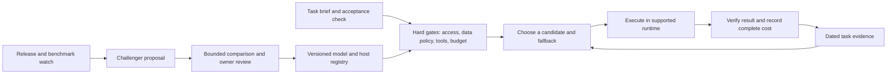

# Proposal: routing across model providers

Proposed 2026-09-25. **This is a design for review, not an active route.** The dated [Codex routing guide](ROUTING.md) and each user's local rules remain in force. No model setting, account, API connection, automation, or default has changed because this file exists.

## Objective

Choose the least costly **available model, effort, host, and tool environment** expected to deliver an accepted result for a specific task. Improve those choices when new models, computers, or observed results change the options. A subscription, API account, and local model are different access paths with different limits; the route must record which path can actually execute the task.

## Keep three layers separate

1. **Public policy:** task families, evaluation method, dated candidate recommendations, evidence links, and known limits. This repository can provide it to any computer.
2. **Private inventory:** subscriptions, API availability, local models on each computer, memory and accelerator capacity, context and tool limits, allowed data classes, budget caps, and provider-specific launch commands. Never publish credentials, host addresses, private projects, prompts, or account limits here.
3. **Execution adapter:** the supported CLI, app, API, or local server that can launch a particular model and report the model actually used. A Markdown recommendation is not an adapter. Do not route by scraping another product's login session or assume a chat subscription supplies API credits.

At first, the system can recommend a route for a human or agent to select. Automatic dispatch is a later capability and only for a tested adapter with explicit authorization. One agent remains the default; changing providers does not imply running agents in parallel.

## Candidate registry

Each *candidate* is a model **plus** an access path, host, and configuration. Keep this information in a versioned registry with one record per executable combination:

| Field | Meaning |
| --- | --- |
| `candidate_id`, `provider`, `model_id`, `model_version` | Exact executable identity, not a marketing family name. |
| `access_mode`, `host`, `adapter`, `available` | Subscription app, supported CLI, API, or local runtime; verified reachability and date. Host and account details stay private. |
| `task_families`, `modalities`, `tools`, `context_limit`, `effort` | What the route can do in this runtime. Unknown is a valid value. |
| `data_class`, `residency`, `retention` | The work it may receive under applicable local policy; verify terms before sending private material. |
| `price_basis`, `quota`, `latency`, `hardware_cost` | Credits, API tokens, subscription allowance, or local resource use. Keep units distinct. |
| `evidence`, `last_checked`, `review_due`, `status` | Links to task-specific comparisons and one of `discovered`, `eligible`, `challenger`, `approved`, `retired`. |

Maintain a **separate private host registry** for each desktop, MacBook, and Mac Mini: memory and accelerator capacity; installed runtimes and model versions; free memory and current load; supported tools; reachability; observed tokens per second, queue time, and failure rate; and last successful run. A model that works on the desktop does not become an eligible Mac Mini route. Treat an offline machine as unavailable and fall back without waking or installing anything automatically. Recheck capacities and performance after hardware, runtime, or model updates.

Do not write a price or capability into the registry merely because a vendor announced it. Check the account and specific host at execution time, and expire unverified availability and prices. Retain old registry revisions so a route can be explained or rolled back.

### Candidate families to evaluate now

These are **challenger hypotheses**, not winners for this workspace:

| Task family | Candidates worth comparing | Acceptance emphasis |
| --- | --- | --- |
| Product and visual design | Current Codex route, Claude in its design-capable environment, Grok's visual/prototype environment, suitable local open weights | A usable design in the real product, fidelity to constraints, accessibility, iteration cost. Anthropic offers Claude Design; this does not prove it beats another model on these tasks. [Anthropic](https://www.anthropic.com/news/claude-design-anthropic-labs) |
| App implementation and debugging | Current Codex route, Claude coding environment, Grok coding environment, local open weights where tools and context suffice | Correct behavior, maintainability, verified task completion, human repair and elapsed time. Grok 4.6 is offered for coding, but provider benchmarks are discovery evidence. [xAI](https://x.ai/news/grok-4-6) |
| Bulk extraction, classification, or drafting | Low-cost hosted models and local open weights, with a frontier fallback | Structured accuracy, privacy eligibility, throughput, rejected outputs, and local resource use. Qwen publishes open-weight models and runtime options. [Qwen](https://github.com/QwenLM/Qwen3.8) |
| Typed decisions inside software | Deterministic code first; Jev or a constrained model only when rules are too brittle | Calibrated classification/choice quality, false-positive cost, latency, and fallback behavior. Jev returns typed decisions rather than generated prose or code, so it is not a chat or coding replacement. [TypeSafe AI](https://typesafe.ai/blog/introducing-system-one-models-and-jev) |

## Priority lists and fallback

The user-facing route is an **ordered list for each task type**, not one model for every conversation. The entries below are initial hypotheses for evaluation; they are not published winners or an active dispatch configuration. Each name means that model **in its supported product or adapter**, and the private inventory decides whether the user has access.

| Task type | Provisional priority to evaluate |
| --- | --- |
| Visual product design | Claude's design-capable environment → Codex Astra → Grok's visual/prototype environment → eligible local vision model |
| Routine app coding | Codex Sol → Claude coding environment → Grok coding environment → eligible local coding model |
| Hard architecture or benchmark validity | Codex Astra → strongest accessible Claude coding/research environment → Grok → local model only if it clears the same quality floor |
| Repetitive coding, extraction, and private bulk work | Eligible local model → Codex Luna → other available low-cost hosted model → stronger model if verification fails |
| Fast typed classification in software | Deterministic rule → eligible local classifier or Jev → a stronger model when the error cost warrants it |

The order is revised **per row** after comparable task evidence. It can differ by host: a model may be first on a desktop with enough memory and absent on a smaller computer. A product subscription is an eligible route only through its supported user or CLI interface; do not silently convert it into API access.

At execution time, walk the selected row and skip any entry that fails a hard gate: no subscription or API access, unsupported tool or data class, offline host, insufficient memory, exhausted quota, or a previously failed quality floor. If the preferred service reports a credit, rate, or availability limit, continue to the next eligible entry and record the reason. Check official quota/usage information when exposed; otherwise use a confirmed limit response rather than guessing that monthly credits are gone.

If all hosted subscriptions are unavailable, a local model can take the work **when that task's quality floor and tools fit the local route**. For a demanding task it may instead produce a draft for later review or stop and request a suitable route. Never label an unverified local answer as equivalent to a frontier result. Before resuming a failed task on another model, carry the task brief, evidence, and current state; confirm whether a side-effecting action already happened so failover does not duplicate it.

**Automation boundary:** a shared recommendation and fallback order can work across all subscriptions immediately. Automatic failover works only where a supported adapter can launch the next service, detect its limit, and transfer the task state. Some consumer chat subscriptions may expose neither a programmable quota nor a supported way to dispatch from another app. For those entries, the router produces a handoff with the next choice; it must not scrape login sessions or claim a switch occurred. Routing to another computer requires an authorized, reachable local service on that host; a saved model alone is insufficient.

## Route one task

1. Write the expected result, task family, data sensitivity, required tools, acceptance check, deadline, and spend cap. A task may need different routes for design, implementation, and verification.
2. Eliminate unavailable model/host combinations and those lacking the required memory, tools, context, data authorization, or budget. Prefer deterministic software for deterministic work. A model file on a machine is discovery evidence; a successful run with the required tools is eligibility evidence.
3. From eligible candidates, use **workspace evidence for this task family** to estimate the chance of an accepted result and the complete cost of reaching it. Include retries, tool and review time, context transfer, and subscription or local capacity. When evidence is thin, state uncertainty and choose a conservative candidate or a bounded challenger run.
4. Name a fallback before starting. Switch only when a failed acceptance check or newly discovered requirement warrants it; record why. A provider outage is an access failure, not proof that another model is smarter.
5. Record intended candidate and host, runtime-confirmed model/configuration and host, acceptance result, retries, elapsed time, usage with its unit, and human repair. Do not infer a model from the app name. Do not combine subscription credits, API dollars, and local compute into a fake universal token price.

## How recommendations change

**New release or benchmark:** add a `discovered` candidate and record the source and date. Check whether the model is available through an authorized access path. Public benchmarks shortlist candidates; they do not decide a workspace route. A coding benchmark's row may represent a whole agent and its settings, not the bare model. [Artificial Analysis methodology](https://artificialanalysis.ai/methodology/coding-agents-benchmarking)

**Challenger evaluation:** use a small set of representative, permission-safe tasks from each affected family. Freeze the brief and acceptance rubric before comparing candidates. Hold tool access and time budget comparable where possible, and record harness differences. For design, use blinded review of actual rendered artifacts against the same brief; for code, inspect behavior and implementation, not only a public score. Measure accepted result per complete task cost, with uncertainty and sample size. Do not run paid comparisons or export private work without the applicable approval.

**Promotion:** propose a route change only when the challenger meets the quality floor and the full cost or user outcome improves on repeated relevant work. Require owner approval before publishing a new default or changing local settings. A new release alone never promotes itself. Keep the previous route and rollback trigger.

**Review cadence:** extend the existing proposal-only weekly review to scan OpenAI, Anthropic, xAI, relevant open-weight releases, Jev's decision-model niche, availability, pricing, retirements, and local task evidence. Stay quiet when nothing material changed. On a material change, create a dated proposal or pull request; do not merge it or reconfigure running agents automatically. Trigger an earlier review after a consequential failure or a release that directly affects an active task family.

## First implementation slice

1. Confirm private access paths and inventory each computer separately. A model file on disk does not prove a serving process, tool integration, or acceptable speed.
2. Build the private inventory and a small, sanitized task-card template. Start with recommendations and manual launches; preserve the current Codex default and existing agents.
3. Compare one design task and one coding task on the current route against the strongest eligible Claude and Grok alternatives, plus the local model where suitable. Do not declare a global winner from these pilots.
4. Only after those results, update the public route table and the weekly review prompt through their normal owner approval. Add dispatch adapters separately, with explicit fallbacks and confirmed model reporting.

Success is a route that explains **why this candidate was chosen for this task, what actually ran, and whether its result was worth the total cost**. The first review may conclude that the existing default should remain.
